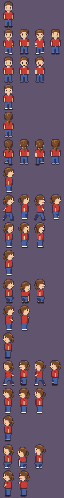
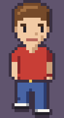
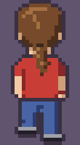
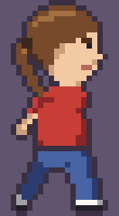
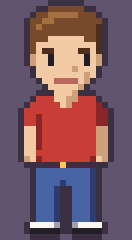
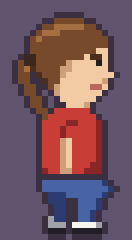
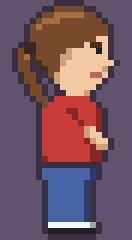

# Adventure-Held – prozedurale Pixel-Art-Sprites

Eine Spielfigur für ein Point-and-Click-Adventure im Stil von *Maniac Mansion*: männlich, brauner Pferdeschwanz, rotes T-Shirt, Jeans, Turnschuhe. Die Figur steckt komplett im Python-Code. Es gibt keine Bilddateien als Quelle, jedes Einzelbild wird beim Import aus ASCII-Zeilen erzeugt.



| Laufen vorn | Laufen hinten | Laufen rechts | Reden | Aufheben | Benutzen |
|---|---|---|---|---|---|
|  |  |  |  |  |  |

## Schnellstart

Voraussetzung ist Python 3 mit [Pillow](https://pillow.readthedocs.io/):

```sh
pip install pillow
python3 adventure_hero.py
```

Das Skript schreibt nach `out/`:

- `hero_sheet.png`: alle Ansichten und Animationen in einem Sheet (4-fach vergrößert, eine Zeile pro Animation)
- `hero_<ansicht>_<animation>.gif`: jede Animation mit mehr als einem Bild als GIF (6-fach vergrößert)

## Dateien

| Datei | Inhalt |
|---|---|
| `pixelart.py` | Die Grundpalette `PAL` und die Hilfsfunktionen `sprite()`, `mirror()`, `_outlined()` |
| `adventure_hero.py` | Die Figur selbst: ASCII-Teile, Zusammenbau der Animationen, Vorschau-Export |
| `out/` | Die erzeugten Vorschaubilder |

## So funktioniert es

### 1. Pixel als Buchstaben

Jedes Sprite ist eine Liste gleich langer Strings. Jedes Zeichen ist ein Pixel, `.` ist transparent, alle anderen Buchstaben sind Farben:

```python
".....hhhhhh.....",
"...hhuuuuuhhh...",
"..hcHHccccHHcH..",   # Augenbrauen (H) auf Haut (c)
"..CcckccccckcC..",   # Augen (k)
```

`sprite(rows, pal)` in `pixelart.py` macht daraus ein RGBA-Bild von Pillow. Welche Farbe ein Buchstabe hat, steht in der Grundpalette `PAL`. Die Figur bringt mit `HERO_PAL` eine eigene kleine Palette mit, die einzelne Einträge überschreibt:

| Zeichen | Bedeutung |
|---|---|
| `u` `h` `H` | Haare hell / mittel / dunkel |
| `c` `C` | Haut / Hautschatten |
| `t` `T` | T-Shirt / Schatten |
| `n` `N` | Jeans / Schatten |
| `z` | Haargummi |
| `l` | Lippen |
| `k` | Schwarz (Augen, Mund, Sohlen), aus `PAL` |
| `w` `e` | Weiß / Grau (Turnschuhe), aus `PAL` |
| `x` `y` | Gürtel / Gürtelschnalle, aus `PAL` |

Groß- und Kleinbuchstaben sind meist dieselbe Farbe, hell und dunkel. So sieht man Licht und Schatten schon im Quelltext.

### 2. Die Figur aus Teilen zusammensetzen

Das ASCII-Raster der Figur ist 16 × 38 Pixel und besteht aus drei Blöcken, die untereinander gehängt werden:

- **Kopf**: 14 Zeilen (`_FRONT_HEAD`, `_BACK_HEAD`, `_SIDE_HEAD`)
- **Oberkörper mit Armen**: 12 Zeilen (`_FRONT_TORSO`, `_SIDE_TORSO['mid' | 'fwd' | 'back' | 'reach']` …)
- **Beine**: 12 Zeilen (`_FRONT_LEGS['stand' | 'l' | 'r']`, `_SIDE_LEGS['stand' | 'stride' | 'pass' | 'crouch']` …)

Weil das alles Listen von Strings sind, ist eine Pose einfach eine Summe:

```python
stand    = _SIDE_HEAD + t['mid']  + l['stand']
stride_a = _SIDE_HEAD + t['back'] + l['stride']   # Bein vor, Arm zurück
```

Für Mimik ersetzt `_patch(rows, at, new)` einzelne Zeilen einer fertigen Pose. Reden tauscht die Mundzeilen 11–12 gegen `_FRONT_MOUTHS` bzw. `_SIDE_MOUTHS` (zu, halb offen, offen). Blinzeln tauscht die Augenzeilen gegen `_FRONT_EYES_SHUT` bzw. `_SIDE_EYE_SHUT`.

Beim Aufheben ist der Körper vorgebeugt. Dafür gibt es eigene Blöcke (`_SIDE_BEND_TORSO`, `_SIDE_BEND_LEGS`), und der Kopf wird um zwei Pixel nach vorn geschoben (`'..' + r`).

### 3. Vom Raster zum Einzelbild

`_frame(rows, bob)` macht aus einer Pose ein fertiges Einzelbild:

1. `sprite()` erzeugt das Bild mit `HERO_PAL`.
2. Es wird auf eine Leinwand mit `HERO_PAD` = 2 Pixel Rand links und rechts gesetzt, unten bündig. `bob` hebt die ganze Figur um Pixel an. Das ergibt das Auf und Ab beim Laufen.
3. `_outlined()` zieht einen 1 Pixel breiten dunklen Umriss um alle deckenden Pixel (4er-Nachbarschaft) und vergrößert die Leinwand dafür um 1 Pixel pro Seite.

Jedes Einzelbild ist damit **22 × 40 Pixel** groß, in allen Ansichten und Animationen gleich. Die Figur verrutscht also beim Wechsel der Animation nicht.

### 4. Ansichten und Animationen

`_build_front()`, `_build_back()` und `_build_right()` bauen je ein Dictionary `{animation: [bilder]}`. Die Ansicht nach links ist nur die gespiegelte rechte (`mirror()`).

| Animation | Bilder | vorn | hinten | rechts / links |
|---|---|---|---|---|
| `stand` | 1 | ✓ | ✓ | ✓ |
| `walk` | 4 (Schritt, Durchschwung, Schritt, Durchschwung) | ✓ | ✓ | ✓ |
| `talk` | 3 (Mund zu, halb, offen) | ✓ | | ✓ |
| `blink` | 1 | ✓ | | ✓ |
| `pickup` | 3 (hocken, bücken, hocken) | | | ✓ |
| `use` | 2 (Arm vor, Arm ausgestreckt) | | | ✓ |

Beim Laufen von vorn und hinten wechseln die Beine (`l` / `r` angehoben), und die Hand auf der Seite des angehobenen Fußes schwingt ein Pixel nach vorn (`_FRONT_TORSO_SWING`). In der Seitenansicht wechseln sich zwei Schrittstellungen mit gespreizten Beinen und entgegengesetztem Armschwung ab, dazwischen liegt jeweils der Durchschwung mit `bob=1`.

## Im Spiel verwenden

```python
from adventure_hero import HERO, HERO_FOOT, HERO_CX

frames = HERO['left']['walk']          # Liste von PIL-Images (RGBA, 22 × 40)
img = frames[tick // 4 % len(frames)]

# Figur so platzieren, dass ihre Füße auf (x, y) stehen:
screen.alpha_composite(img, (x - HERO_CX, y - HERO_FOOT))
```

- `HERO[ansicht][animation]` mit Ansicht `'front'`, `'back'`, `'right'`, `'left'`
- `HERO_FOOT`: die Bildzeile, auf der die Sohlen stehen (darunter kommt nur noch der Umriss)
- `HERO_CX`: die x-Position der Körpermitte im Einzelbild

Alle Bilder sind in Spielauflösung (1 Pixel = 1 Spielpixel). Vergrößert wird erst beim Anzeigen, und zwar mit `Image.NEAREST`, damit die Pixel scharf bleiben.

## Die Figur ändern

- **Farben**: Werte in `HERO_PAL` ändern. Das wirkt sofort auf alle Bilder.
- **Pixel**: die ASCII-Zeilen direkt bearbeiten. Jede Zeile muss 16 Zeichen lang bleiben, und Kopf, Oberkörper und Beine müssen ihre Zeilenzahl behalten, sonst passen die Zeilennummern für `_patch()` (Mund, Augen) nicht mehr.
- **Neue Animation**: in der passenden `_build_*()`-Funktion einen Eintrag ergänzen. Sheet und GIFs übernehmen ihn beim nächsten `python3 adventure_hero.py` automatisch.
